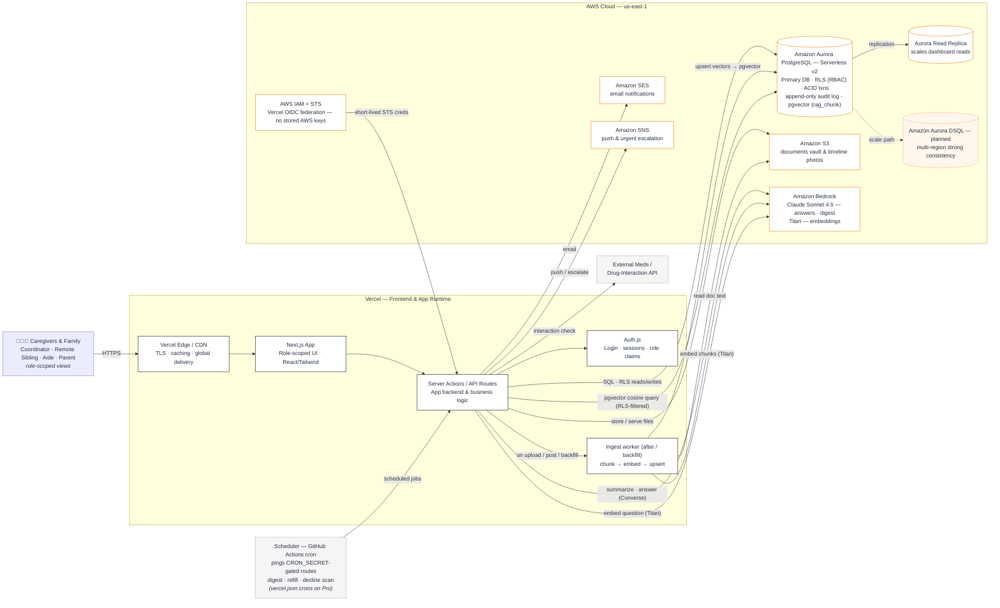

# Kintwadi — Architecture

**Track:** Monetizable B2C · **Primary database:** Amazon Aurora PostgreSQL (Serverless v2 — Row-Level Security · ACID · append-only audit · **`pgvector`**) · **AI:** Amazon Bedrock — Claude Sonnet 4.5 (generation) + Titan embeddings (retrieval) · **Frontend:** Next.js on Vercel.

> **RAG note:** "Ask Kintwadi" is Retrieval-Augmented Generation, kept **entirely on AWS and inside Aurora**. Documents (uploaded to S3), timeline events, and audit entries are chunked, embedded with **Amazon Bedrock Titan**, and stored as vectors **in Aurora itself** — the `rag_chunk` table via the **`pgvector`** extension, one row per chunk, tenant-scoped + sensitivity-tagged. A question is embedded and a pgvector cosine search retrieves the relevant chunks; because those rows live under the same RLS as the rest of the record, **the database itself filters retrieval to what the asker is allowed to read** (no separate vector-store ACL to keep in sync). **Claude on Bedrock** then writes a grounded, cited answer. One database does relational *and* vector — the Aurora thesis, end to end.

> Two diagram sources are in this folder:
> - **`Kintwadi-Architecture.drawio`** — editable, with AWS icons + the dashed AWS grouping box. Open it to export the PNG/SVG you submit.
> - The **Mermaid diagram below** — renders on GitHub/Devpost previews and is easy to keep in sync.

---

## Diagram (Mermaid)



---

## Component legend — *what it is* + *what it does* + *why this choice*

| Component | What it is | What it does | Why it's here |
|---|---|---|---|
| **Caregivers & Family** | The end users (4 personas) | Log meds, post updates, read the digest, manage tasks | Each sees a role-scoped view of one shared record |
| **Vercel Edge / CDN** | Vercel's global edge network | TLS termination, caching, fast global delivery | Required: frontend on Vercel; gives low latency worldwide |
| **Next.js App** | Hand-built React/Next.js frontend (Radix + Tailwind) | Renders the role-specific UI | Deployed on Vercel — the hackathon's required frontend platform |
| **Server Actions / API Routes** | Next.js server-side backend | All business logic, validation, DB/AI/notify orchestration | Keeps secrets server-side; the single integration point |
| **Auth.js** | Authentication & session layer | Login, sessions, issues role claims used for access control | Roles drive both UI and DB-level permissions |
| **Scheduler (GitHub Actions cron)** | Scheduled trigger pinging the app's `CRON_SECRET`-gated cron routes | Fires Daily Digest, reminders, refill & decline scans | The routes are scheduler-agnostic; GitHub Actions drives them because Vercel Hobby caps crons at once/day — on Pro the same routes move into `vercel.json` unchanged |
| **Ingest worker** | Server-side RAG pipeline (runs via Next.js `after()` on upload/post, plus an admin-gated `/api/ingest` backfill route) | Extracts text (PDF/text), chunks it (LangChain), embeds it (Titan), and upserts to the Aurora `rag_chunk` table | Keeps indexing off the request's critical path; backfill re-indexes historical data |
| **Amazon Aurora PostgreSQL (Serverless v2)** | **The primary database — relational *and* vector** | Stores the relational care record; enforces **RLS (RBAC)**; runs **ACID** med transactions; keeps an **append-only audit log**; hosts the **`pgvector`** chunk index (`rag_chunk`) for Ask | The deliberate architectural choice — one access-controlled database does relational *and* AI retrieval, so vector search inherits the exact same RLS boundary |
| **Aurora Read Replica** | Read-scaling replica | Serves read-heavy dashboards | Keeps the glanceable "Is she okay today?" view fast at scale |
| **Amazon S3** | Object storage | Stores documents (insurance, directives, labs) and timeline photos; the ingest worker reads file bytes from here to extract text | Right tool for files; keeps blobs out of the relational DB |
| **Amazon Bedrock — Claude Sonnet 4.5** | Managed LLM service (Converse API) | **Generates** the grounded "Ask Kintwadi" answers and the Daily Digest from retrieved context | Keeps generation inside AWS; Claude for warm, accurate, well-grounded answers |
| **Amazon Bedrock — Titan Text Embeddings v2** (1024-d) | Managed embedding model | Turns document/timeline/audit chunks **and** the user's question into vectors stored in pgvector | All-AWS embeddings (no external provider); same Bedrock credentials as generation |
| **Amazon SES** | Email service | Sends digests and notifications | Reliable transactional email (the email layer is provider-pluggable — SES first, SMTP/Resend fallbacks for local dev / SES-sandbox accounts) |
| **Amazon SNS** | Pub/sub & push | Delivers push + urgent escalations (e.g., a logged fall) | Fan-out alerts to all coordinators instantly |
| **AWS IAM + STS (Vercel OIDC)** | Keyless credential federation | Each Vercel invocation exchanges its OIDC token for short-lived STS credentials (`AWS_ROLE_ARN`, `src/lib/aws/credentials.ts`) used by Bedrock/S3/SES/SNS | No long-lived AWS keys in production; the public repo never holds secrets |
| **External Meds / Drug-Interaction API** | Third-party clinical data | Checks new meds for interactions & allergy conflicts | Powers the medication-safety feature (mocked for the demo) |
| **Amazon Aurora DSQL** *(planned)* | Distributed, multi-region SQL | Active-active, strongly-consistent writes across regions | Roadmap: low-latency consistency for globally distributed families |

---

## Request flows (the ones that matter for the demo)

1. **Log a medication (ACID + RLS).** Aide → UI → Server Action → Aurora: a single transaction logs the administration event, decrements supply, and appends a timeline entry. RLS guarantees the aide can only touch the patient they're assigned to. A low-supply threshold queues a refill task.
2. **The Daily Digest (AI + scheduled).** Scheduler (GitHub Actions cron, hourly) → `CRON_SECRET`-gated route → reads the day's events from Aurora → Bedrock (Claude) summarizes into a warm update → stored back in Aurora → SES/SNS notifies the remote sibling.
3. **Ingest (RAG indexing).** A document upload (to S3) or a timeline post triggers the ingest worker via `after()` (and an admin-gated `/api/ingest` backfills history). The worker extracts text → chunks it (LangChain) → embeds each chunk with **Bedrock Titan** → upserts into Aurora's **`rag_chunk`** table (circle_id, source, **sensitivity tier**, title, href, timestamps, content, `vector(1024)`). The chunk rows are written under the actor's RLS context, so they're tenant-correct by construction.
4. **Ask Kintwadi (RAG retrieval + generation).** Family member asks a natural-language question → Server Action embeds it with **Bedrock Titan** → a **pgvector** cosine query (`embedding <=> $q`) runs inside an RLS-scoped transaction, so the `rag_chunk` SELECT policy **filters to the sensitivity tiers the asker's role may read automatically** → the retrieved chunks (plus a structured snapshot of meds/vitals/appointments/tasks) become grounded context → **Claude on Bedrock (Converse)** composes the answer with citations. The read is written to the append-only audit log.

---

## Ask Kintwadi — the RAG pipeline (detail)

```
INGEST  (on upload / post, or admin backfill)
  S3 file ─▶ extract text (pdf-parse / decode)
          ─▶ chunk (LangChain RecursiveCharacterTextSplitter, overlap)
          ─▶ embed (Bedrock Titan Text Embeddings v2, 1024-d)
          ─▶ upsert ▶ Aurora  rag_chunk  (pgvector)
                      columns: circle_id, source, sensitivity, title, href,
                               source_created_at, content, embedding vector(1024)
                      (HNSW cosine index; unique on source+source_id+chunk_index)

ASK     (user question)
  question ─▶ embed (Bedrock Titan)
           ─▶ pgvector cosine query inside withAuthedDb (RLS):
                SELECT … ORDER BY embedding <=> $q LIMIT k
                ↳ rag_chunk SELECT policy filters circle + sensitivity ∈ role-allowed tiers
           ─▶ top-k chunks  +  structured snapshot (meds / vitals / appts / tasks)
           ─▶ Claude Sonnet 4.5 (Bedrock Converse): grounded answer + cited sources
           ─▶ recordAuditEvent(read)   ← every answer is audited
```

**Security invariants carried into the AI layer (same fail-closed posture as the DB):**
- **Isolation is the database's job, not the app's:** the `rag_chunk` rows are tenant-scoped and the query runs under RLS, so a similarity search can only ever return chunks in the caller's circle — there is no separate vector-store ACL that could drift from the DB.
- **Sensitivity is enforced by the same policy as documents:** chunks are tagged `standard | sensitive | restricted`; the RLS SELECT policy admits only the tiers the asker's role may read (e.g. a read-only member never retrieves restricted-document or audit chunks). Audit-derived chunks are indexed as `restricted` so only coordinators can surface them.
- **Grounded only:** Claude is instructed to answer *only* from retrieved context and to cite sources; "I don't have that in the record" is a valid answer.
- **Audited:** answering reads sensitive data, so each Ask writes a `read` entry to the append-only audit log.

---

## 40-second architecture narration (for the 3-min video)

> "Kintwadi runs on the hackathon's Zero Stack. The frontend is a Next.js app deployed on Vercel's edge. Every request goes through our server actions, which talk to **Amazon Aurora PostgreSQL** — our primary database. Aurora isn't a default here, it's the whole thesis: caregiving is deeply relational and safety-critical, so we use **Row-Level Security** to enforce who-can-see-what *in the database itself*, **ACID transactions** so giving a medication updates the log, the supply, and the timeline atomically, and an **append-only audit log** for medical-grade trust. On top of that record we built **'Ask Kintwadi', a Retrieval-Augmented Generation assistant** — and we kept it entirely inside Aurora: documents, timeline notes, and audit entries are chunked, embedded with **Amazon Bedrock Titan**, and stored as vectors in the same database using **`pgvector`**. Because those vector rows live under the *same* Row-Level Security as everything else, the similarity search obeys the exact permission boundary automatically — a question is matched against only the chunks that asker is allowed to read, and **Claude Sonnet 4.5 on Amazon Bedrock** writes a grounded, cited answer — and even that read is audited. Files live in S3, alerts go out through SES and SNS, and production holds no AWS keys at all — each Vercel invocation exchanges its OIDC token for short-lived STS credentials. Nothing secret ever touches the repo. Aurora Serverless v2 scales with load, and our roadmap moves the record to **Aurora DSQL** for multi-region strong consistency, because the families we serve are spread across the world."

---

## How to export the image you submit

1. Open **https://app.diagrams.net** (no install) → *Open Existing Diagram* → choose `Kintwadi-Architecture.drawio`.
   *(Or use the "Draw.io Integration" extension in VS Code and just open the file.)*
2. Check the AWS icons rendered (they will, via the built-in AWS shape library). Tweak labels/positions as you like.
3. **File → Export as → PNG** (set *Zoom 2x*, *Transparent background* off, *Border width ~10*) — or **SVG** for crispness.
4. Drop the exported image into your Devpost submission and your README, and screen-record it for the video's architecture beat.

**Optional polish:** to swap any labeled box for the exact official AWS icon, open the shape search (bottom-left), type the service name (e.g., "Aurora"), and drag it on. The AWS grouping box and arrows already follow the rules' tips (labeled boxes, single-direction arrows, dashed cloud boundary).
