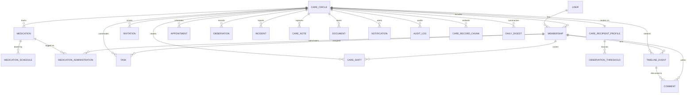

# Kintwadi — Data Model Deep-Dive

*Conceptual model only — no implementation/DDL. This document defines the entities, relationships, integrity rules, and the Row-Level Security (RLS) design behind the data layer, and explains why Amazon Aurora PostgreSQL is the right fit for this domain.*

---

## 1. Why a relational model

Caregiving data is **relational, transactional, and access-controlled** — three properties that point squarely at a relational engine:

- **Relational:** people, roles, medications, administrations, appointments, vitals, documents, and a unified timeline are densely interconnected, and the high-value reads (fair-share contribution, vitals trends, "who did what when") are *joins and aggregations*, not single-key lookups.
- **Transactional:** "give a medication" must update three things at once — the administration log, the remaining supply, and the timeline — atomically. Partial writes are clinically unacceptable.
- **Access-controlled:** different people (a hired aide vs. a daughter vs. a doctor) must see different *rows and columns* of the same record. This is the heart of the product and the heart of the model.

Aurora PostgreSQL serves all three natively: foreign-key integrity, ACID transactions, and **Row-Level Security enforced inside the database**. The model below is built directly around those three properties.

---

## 2. Design principles (applied to every table)

| Principle | Decision | Rationale |
|---|---|---|
| **Identifiers** | UUID (v7) primary keys | Time-sortable for index locality; non-enumerable (no `/patient/123` scraping); merge-safe; forward-compatible with Aurora DSQL (no reliance on central sequences) |
| **Tenant key everywhere** | Every tenant-scoped table carries `circle_id`, even when reachable via a foreign key | Makes the RLS predicate a single indexed check on the row itself — fast isolation, no recursive joins in policies |
| **Soft delete** | `deleted_at` timestamp instead of hard deletes (except true child rows) | Recoverability + a defensible audit trail (medical data shouldn't vanish) |
| **Audit by design** | `created_at`, `updated_at`, `created_by`, `updated_by` on every table; a dedicated append-only `audit_log` | Accountability is a feature, not an afterthought |
| **Optimistic concurrency** | `version`/`updated_at` guard on mutable rows | Prevents two caregivers' edits from silently clobbering each other; maps cleanly to DSQL's optimistic concurrency later |
| **Blobs out of the DB** | Files (docs, photos) live in **S3**; tables hold an `s3_key` + metadata | Keeps the relational store lean; lets RLS govern *access to the metadata/pointer* |
| **Controlled vocabularies** | Enumerated types for role, status, sensitivity, observation type, etc. | Integrity at the schema level instead of free-text drift |
| **Tenant boundary = Care Circle** | One circle centers on one care recipient; a user can belong to many circles | Clean isolation unit for RLS; naturally handles "I care for both parents" via two circles |

---

## 3. Entity-relationship diagram

---

## 4. Entity catalog

> Attributes are listed conceptually (`uuid`, `text`, `enum{…}`, `int`, `numeric`, `timestamptz`, `bool`, `jsonb`, `vector`, `s3_key`). Every tenant-scoped table also carries the standard audit columns (`created_at`, `updated_at`, `created_by`, `updated_by`, `deleted_at`) — omitted below for brevity.

### 4.1 Identity & tenancy

**`user`** — an authenticated identity.
- `id (uuid)`, `email (text, unique)`, `display_name (text)`, `auth_provider_id (text)`, `locale (text)`, `avatar_s3_key (s3_key)`.
- A user may be a member of many circles. The care recipient *may* be a user (simplified view) or may have no login.

**`care_circle`** — the tenant; the community of care around one person.
- `id (uuid)`, `name (text)` (e.g., "Antonio's Care"), `plan (enum{free, plus})`, `primary_timezone (text)`, `owner_membership_id (uuid)`.

**`care_recipient_profile`** — 1:1 with a circle; the person being cared for.
- `id (uuid)`, `circle_id (uuid, unique)`, `full_name`, `date_of_birth`, `blood_type`, `conditions (jsonb)`, `allergies (jsonb)`, `mobility (text)`, `dietary_needs (text)`, `preferences (text)`, `primary_language`, `emergency_contacts (jsonb)`, `insurance_summary (jsonb)`.
- *Emergency card* is a projection of this row + active medications.

**`membership`** — the **access principal**: a user's role inside one circle.
- `id (uuid)`, `circle_id (uuid)`, `user_id (uuid)`, `role (enum)`, `status (enum{active, invited, suspended})`, `relationship_label (text)` (e.g., "Daughter", "Home aide"), `notify_escalations (bool)`.
- **Unique** on (`circle_id`, `user_id`). This table is what every RLS policy consults.

**`invitation`** — onboarding into a circle.
- `id (uuid)`, `circle_id`, `email`, `role (enum)`, `token (text, unique)`, `invited_by (membership)`, `status (enum{pending, accepted, expired, revoked})`, `expires_at`.

### 4.2 Care operations

**`medication`** — a prescribed regimen.
- `id`, `circle_id`, `name`, `strength (text)`, `form (enum{tablet, capsule, liquid, …})`, `route (enum{oral, topical, injection, …})`, `purpose (text)`, `prescriber (text)`, `instructions (text)`, `photo_s3_key`, `supply_count (int, ≥0)`, `refill_threshold (int)`, `is_active (bool)`.

**`medication_schedule`** — one regimen → many dose times.
- `id`, `medication_id`, `time_of_day (time)`, `days_of_week (jsonb/bitmask)`, `dose_amount (text)`, `is_prn (bool)` (as-needed).

**`medication_administration`** — the high-volume event log ("was it taken?").
- `id`, `circle_id`, `medication_id`, `scheduled_for (timestamptz)`, `status (enum{given, taken, skipped, refused, missed})`, `administered_at (timestamptz)`, `administered_by (membership)`, `notes`.
- Each insert is part of the atomic "give a med" transaction (see §6) and emits a `timeline_event`.

**`appointment`** — visits and calls.
- `id`, `circle_id`, `title`, `provider (text)`, `location (text)`, `starts_at`, `ends_at`, `type (enum)`, `assigned_to (membership)`, `prep_notes (text)`, `outcome_summary (text)`, `status (enum{scheduled, done, cancelled})`.

**`task`** — coordination unit (incl. refills).
- `id`, `circle_id`, `title`, `details`, `category (enum{errand, medical, admin, refill, visit})`, `assigned_to (membership)`, `due_at`, `recurrence_rule (text)`, `status (enum{open, doing, done, blocked})`, `completed_at`, `completed_by (membership)`.
- Completed tasks feed the **fair-share** contribution view.

**`care_shift`** — the rota: who is "on".
- `id`, `circle_id`, `membership_id`, `starts_at`, `ends_at`, `kind (enum{in_person, on_call})`.

**`observation`** — vitals, mood, sleep, falls, weight.
- `id`, `circle_id`, `type (enum{blood_pressure, glucose, weight, mood, sleep, temperature, pain, …})`, `value_numeric (numeric)`, `value_secondary (numeric)` (e.g., diastolic), `value_text (text)` (e.g., mood note), `unit (text)`, `recorded_at`, `recorded_by (membership)`.

**`observation_threshold`** — per-recipient safe ranges driving alerts/decline detection.
- `id`, `recipient_profile_id`, `type (enum)`, `min_value`, `max_value`, `direction (enum{above, below, outside})`.

**`incident`** — falls, ER visits, urgent events.
- `id`, `circle_id`, `type (enum{fall, hospitalization, emergency, other})`, `severity (enum{low, medium, high})`, `description`, `occurred_at`, `reported_by (membership)`, `resolution (text)`.
- Triggers **escalation** (SNS) and a high-visibility `timeline_event`.

**`care_note`** — free-text human updates ("Dad ate well, walked 10 min").
- `id`, `circle_id`, `author (membership)`, `body (text)`, `media_s3_keys (jsonb)`, `mood_tag (enum, nullable)`.

**`document`** — S3-backed files with a **sensitivity tier** (the crux of document RLS).
- `id`, `circle_id`, `title`, `sensitivity (enum{general, medical, financial, legal})`, `s3_key`, `content_type`, `expires_at (nullable)`, `is_emergency_visible (bool)`, `uploaded_by (membership)`.

### 4.3 Collaboration & system

**`timeline_event`** — the **activity-stream spine** (see the design call-out in §5).
- `id`, `circle_id`, `actor (membership, nullable for system)`, `event_type (enum{med, vital, appointment, task, note, incident, document, system})`, `summary (text)`, `ref_type (text)`, `ref_id (uuid)`, `occurred_at`, `visibility (enum{all, family_only, clinical, private})`, `is_urgent (bool)`, `payload (jsonb)`.

**`comment`** — threaded discussion on an event (replaces the chaotic group chat).
- `id`, `circle_id`, `timeline_event_id`, `author (membership)`, `body`.

**`notification`** — per-recipient delivery records.
- `id`, `circle_id`, `recipient_membership_id`, `type`, `title`, `body`, `ref_type`, `ref_id`, `channel (enum{in_app, email, push})`, `urgency (enum{normal, urgent})`, `read_at`, `dedupe_key (text, unique)`.

**`audit_log`** — append-only accountability ledger.
- `id`, `circle_id`, `actor_user_id`, `actor_membership_id`, `action (enum{read, create, update, delete, export, login, invite})`, `entity_type`, `entity_id`, `summary`, `request_id`, `occurred_at`.
- **Never updated or deleted** (enforced in §9.6).

### 4.4 AI layer (pgvector)

**`care_record_chunk`** — embeddings powering "Ask Kintwadi" and the digest.
- `id`, `circle_id`, `source_type (text)`, `source_id (uuid)`, `content (text)`, `embedding (vector)`, `created_at`.
- RLS-scoped by `circle_id` so semantic recall can **never** cross families (see §9.7).

**`daily_digest`** — stored, re-readable AI summaries.
- `id`, `circle_id`, `for_date (date)`, `summary (text)`, `model (text)`, `source_event_ids (jsonb)`, `generated_at`.

---

## 5. Design call-out: the timeline as an activity-stream spine

The "How is Mom today?" feed is the product's heartbeat, so its modeling is a **deliberate choice**, not an accident:

- **Option A (rejected): query-time UNION** across meds, vitals, notes, tasks, incidents. Flexible but slow, hard to paginate, and impossible to apply a single visibility rule to.
- **Option B (chosen): a dedicated `timeline_event` table** that every fact-producing action writes to (an *outbox*/activity-stream pattern). Each medication, observation, note, etc. inserts its own canonical row **and** emits a denormalized `timeline_event` carrying a human `summary`, a `visibility` tier, an `is_urgent` flag, and a `ref` back to the source.

Why it's the right call:
1. **One fast, indexed read** — `(circle_id, occurred_at desc)` — drives the feed and pagination.
2. **One place to enforce visibility** — the `visibility` column + RLS governs who sees each event (e.g., a private mental-health note is hidden from the aide).
3. **It *is* the digest input** — the Daily Digest simply reads the day's events; the "Ask Kintwadi" index embeds them.
4. **Comments attach uniformly** to events, so discussion lives next to the care it's about.

---

## 6. Transactions & integrity (ACID)

**The "give a medication" transaction** — one atomic unit:
1. Insert a `medication_administration` (status = given).
2. Decrement `medication.supply_count` (check ≥ 0).
3. Insert a `timeline_event` (summary, visibility).
4. If `supply_count` < `refill_threshold`, create a `task` (category = refill) — idempotently.

Either all four commit or none do. In a key-value store this would be multiple non-atomic writes with no cross-entity guarantee; in Aurora it's a single transaction.

**Referential integrity & constraints:**
- Foreign keys on every relationship; **soft delete** (`deleted_at`) is the default, with hard cascade reserved for true children (e.g., `medication_schedule` when a medication is permanently removed).
- **Check constraints:** `supply_count ≥ 0`; `appointment.ends_at > starts_at`; observation values within sane bounds.
- **Unique constraints:** (`circle_id`, `user_id`) on membership; one `care_recipient_profile` per circle; `invitation.token`; `notification.dedupe_key`.
- **Optimistic concurrency:** mutating writes guard on `version`/`updated_at` to prevent two caregivers from silently overwriting each other.

---

## 7. Role-based access control — the capability matrix

Seven roles, each a distinct persona. `✓` = allowed, `◐` = scoped/limited, `✗` = denied.

| Capability | Owner / Coordinator | Family Admin | Family (limited) | Pro Caregiver | Read-only | Care Recipient | Clinician (read) |
|---|:--:|:--:|:--:|:--:|:--:|:--:|:--:|
| View care timeline & record | ✓ | ✓ | ✓ | ◐ today/assigned | ✓ | ✓ | ◐ clinical |
| Post update / care note | ✓ | ✓ | ✓ | ✓ | ✗ | ✓ | ✗ |
| Log medication given | ✓ | ✓ | ✓ | ✓ | ✗ | ◐ self | ✗ |
| Manage medications (add/edit/stop) | ✓ | ✓ | ✗ | ✗ | ✗ | ✗ | ✗ |
| Record vitals / observations | ✓ | ✓ | ✓ | ✓ | ✗ | ✓ | ✗ |
| Create / assign tasks | ✓ | ✓ | ✓ | ✗ | ✗ | ✗ | ✗ |
| Complete assigned tasks | ✓ | ✓ | ✓ | ◐ assigned | ✗ | ✓ | ✗ |
| View **medical** documents | ✓ | ✓ | ✓ | ◐ care-relevant | ✗ | ✓ | ✓ |
| View **financial / legal** documents | ✓ | ✓ | ✗ | ✗ | ✗ | ✓ | ✗ |
| Report incident | ✓ | ✓ | ✓ | ✓ | ✗ | ✓ | ✗ |
| Manage members / invite / roles | ✓ | ✓ | ✗ | ✗ | ✗ | ✗ | ✗ |
| View audit log | ✓ | ✓ | ✗ | ✗ | ✗ | ◐ own data | ✗ |
| Configure circle / billing | ✓ | ✗ | ✗ | ✗ | ✗ | ✗ | ✗ |

The clearest example: **a Pro Caregiver cannot open financial/legal documents** — and that denial is enforced in the database, not just hidden in the UI.

---

## 8. RLS in one sentence

> A request can touch a row only if the signed-in user holds an **active membership in that row's care circle**, *and* their **role** permits the operation, *and* any **sensitivity/consent** rule on the row allows it — all checked **inside Aurora**, so an application bug cannot leak data.

---

## 9. Row-Level Security policy design

### 9.1 Defense in depth — three layers

| Layer | Where | Responsibility |
|---|---|---|
| **L1 — Tenant isolation** | Aurora RLS | A user only ever sees rows from circles they belong to. Non-negotiable, unconditional. |
| **L2 — Role & sensitivity** | Aurora RLS (per-command policies referencing the membership role + row sensitivity) | Who may read vs. write each table; who may see financial/legal documents; append-only audit. |
| **L3 — Capabilities & UX** | Application | Affordances, richer business rules, friendly errors. **Never the only guard** — it's the convenience layer on top of L1/L2. |

The principle: the **database is the last line of defense**. If the app forgets a `WHERE` clause, L1/L2 still hold.

### 9.2 The trusted session context

- Each request authenticates via Auth.js, then sets a **trusted session context** in the DB connection — the current `user_id` (and optionally the active `circle_id`).
- The app connects using a **least-privilege database role that does *not* have `BYPASSRLS`** and does not own the tables. Policies therefore *always* apply to application traffic.
- `FORCE ROW LEVEL SECURITY` is enabled so that even a table-owner connection is subject to policies — closing the usual RLS bypass.
- A small **security-definer helper** resolves "the set of (circle_id, role) the current user holds" from `membership`; every policy is expressed in terms of it, so the rules read uniformly and stay fast (one indexed lookup on `membership`).

### 9.3 Tenant isolation (applies to *every* tenant-scoped table)

> **Predicate (read & write):** the row's `circle_id` is in the current user's set of active, non-deleted memberships.

Because `circle_id` lives on every row, this is a single indexed check — no recursive joins in the policy. A user in three circles automatically sees only the active circle's data; cross-circle leakage is structurally impossible.

### 9.4 Role-gated writes (per-command policies)

Expressed conceptually, per table:

- **`medication` (insert/update/delete):** allowed only when the user's role in that circle ∈ {Owner, Family Admin}.
- **`medication_administration` (insert):** allowed when role ∈ {Owner, Family Admin, Family, Pro Caregiver, Care Recipient (self)}.
- **`task` (insert/assign):** role ∈ {Owner, Family Admin, Family}; **complete** allowed to the assignee or an admin.
- **`membership`/`invitation` (write):** role ∈ {Owner, Family Admin}; only **Owner** may change billing/plan or transfer ownership.

Reads of clinical tables follow the capability matrix; **Read-only** gets `SELECT` and no write policy at all.

### 9.5 Sensitivity-scoped documents (the central access rule)

> **`document` SELECT predicate:** tenant isolation holds **AND** one of:
> - `sensitivity = general`, OR
> - `sensitivity = medical` and role ∈ {Owner, Family Admin, Family, Pro Caregiver (care-relevant), Care Recipient, Clinician}, OR
> - `sensitivity ∈ {financial, legal}` and role ∈ {Owner, Family Admin} (or an explicit per-document grant), OR
> - `is_emergency_visible = true` (the emergency card).

Net effect: the hired aide and read-only relatives **physically cannot** read financial or legal documents — the rule is enforced in the database, not the UI.

### 9.6 Append-only audit log

- **Insert:** permitted for any in-circle action by the app context.
- **Select:** permitted only when role ∈ {Owner, Family Admin} (the recipient may see entries about their own data).
- **Update / Delete:** **no policy exists, and the privilege is revoked** → the table is effectively immutable to the application role — accountability you can trust.

### 9.7 pgvector under RLS

`care_record_chunk` carries `circle_id` and the same tenant-isolation policy, so **semantic search inherits security**: an "Ask Kintwadi" query physically cannot retrieve another family's memories, even by vector similarity.
- **Performance approach:** pre-filter by `circle_id` (a family's history is small-N), then run the ANN search within that scope — combining a partial/composite strategy with the RLS predicate as the hard guarantee.

### 9.8 (Advanced) Care-recipient consent overrides

For dignity, the recipient can hide a category (e.g., mental-health notes) from specific members. Modeled as consent rules the document/note policies consult — so even an otherwise-permitted role is filtered out. Flagged as post-MVP; the policy model already accommodates it.

---

## 10. Indexing & performance (conceptual)

- **`circle_id` index on every tenant table** — serves both isolation and the RLS predicate.
- **Composite indexes** for the hot reads: `timeline_event (circle_id, occurred_at desc)`, `medication_administration (circle_id, scheduled_for)`, `task (circle_id, status, due_at)`, `observation (circle_id, type, recorded_at)`, `document (circle_id, sensitivity)`, `audit_log (circle_id, occurred_at)` and `(entity_type, entity_id)`.
- **Partial indexes** for active subsets, e.g., active medications only.
- **pgvector index** (HNSW or IVFFlat) on `care_record_chunk.embedding`, scoped per circle.
- **Read replica** (from the architecture) absorbs dashboard reads; **Serverless v2** scales the writer with load.

---

## 11. Why Aurora PostgreSQL over DynamoDB *for this model*

| Requirement in this domain | Aurora PostgreSQL | DynamoDB |
|---|---|---|
| Cross-entity atomic writes ("give a med") | Native ACID transaction | No multi-item transaction with the same guarantees/ergonomics |
| Many-to-many, ad-hoc joins (fair-share, trends) | First-class SQL joins & aggregates | Requires denormalization or fan-out; analytics are painful |
| **Row- and column-level access control** | **Native RLS, enforced in-engine** | Must be hand-rolled in app code (fragile) |
| Referential integrity across 20+ entities | Foreign keys & constraints | App-enforced only |
| Semantic search beside the operational data | `pgvector` in the same database | Separate vector store + sync |

The access patterns here are **relationship-rich and security-critical**, not single-key and high-throughput — so Aurora isn't just acceptable here, it's the *correct* call.

---

## 12. Scope & forward-compatibility

**The MVP slice** (what to build first):
`care_circle`, `membership` (roles), `care_recipient_profile`, `medication` (+ `medication_schedule`, `medication_administration`), `observation`, `timeline_event` (+ `comment`), `task`, `document` (with sensitivity), `audit_log`, `care_record_chunk` + `daily_digest`, `invitation`.

**Defer (show as roadmap):** `care_shift`, `observation_threshold` depth, consent overrides, clinician role.

**Aurora DSQL forward-compat:** UUID (v7) keys, no reliance on central sequences, tenant key on every row, and optimistic concurrency mean this relational shape **transfers to Aurora DSQL** when global, multi-region strong consistency becomes the priority — the architecture diagram's stated scale path.

---

*Pairs with [`architecture.md`](./architecture.md) (system architecture) — together they document the data layer and how it runs.*
